# Analise e modelagem de teste

### Visão geral das tecnicas de teste

- Dão suporte ao testador a analise do teste (o que testar) e no projeto do teste (como testar)

- Ajudam a desenvolver um conjunto relativamente pequeno, mas suficiente, de casos de teste de forma sistematica.

- Ajudam o testador a **definir condições de teste**

---

#### Caixa preta

- Análise do comportamento sem acesso a estrutura interna
- Casos de teste são independentes

---

#### Caixa Branca

- Baseiam-se em uma analise da estrutura interna
- Casos de testes dependem de como o software é projetado

---

#### Baseadas na experiencia

- Usam o conhecimento e a experiencia dos testadores para o projeto e casos de teste
- Podem detectar defeitos não detectados nas tecnicas de teste preta e branca

---

## Tecnicas de teste CAIXA PRETA

#### Particionamento de equivalencia
- Divide os dados em partições
- Partição Valida contem valores que devem ser aceitos
- Partição Invalida contem valores que devem ser rejeitados


- COBERTURA = **PARTIÇÕES TESTADAS / TOTAL DE PARTIÇÕES**

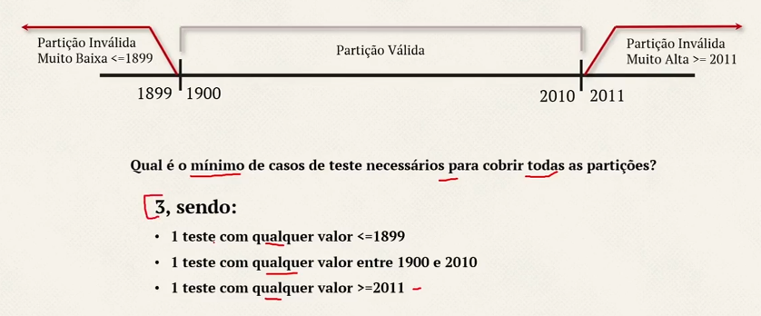

 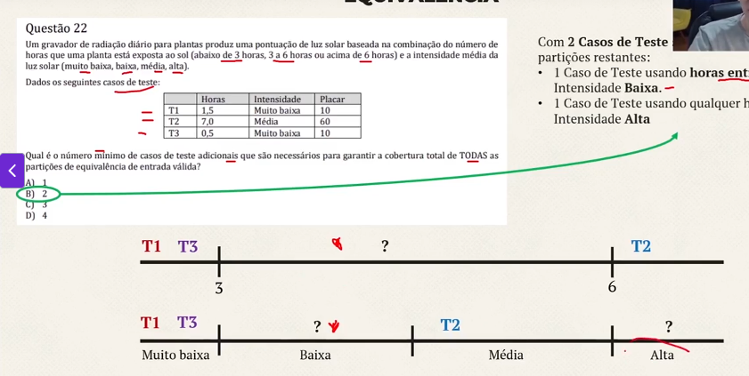


---

#### Analise de valor limite

- so pode ser usado em uma partição ordenada (dados numericos ou sequenciais)
- Os valores minimo e maximo são seus valores limites


- **COBERTURA = LIMITES TESTADOS / TOTAL DE LIMITES**


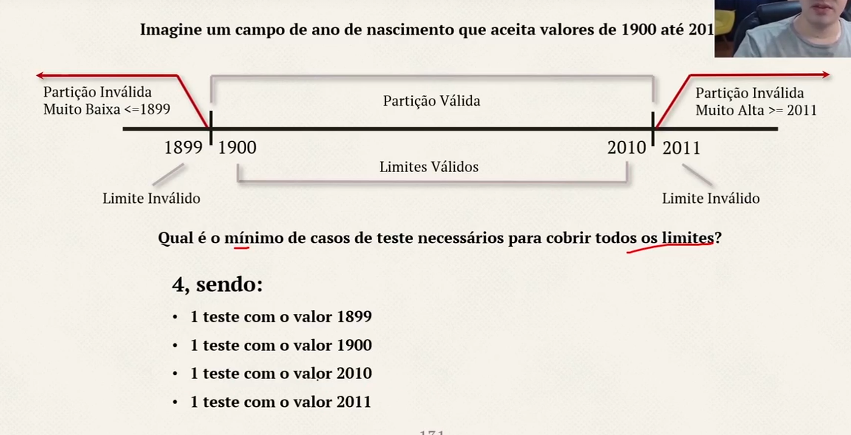

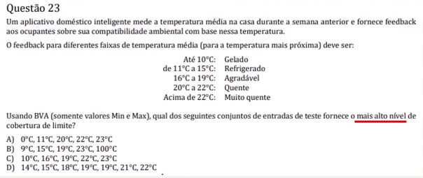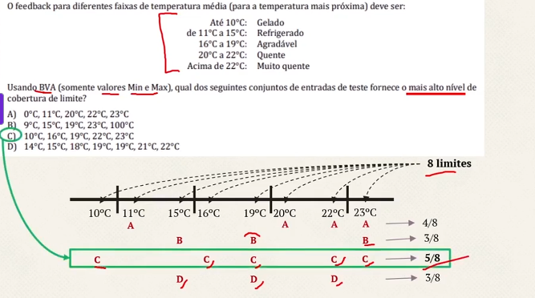


---

#### Tabela de decisão

- Testam combinações que levam a resultados diferentes

- É formada de **condicoes** (entradas) e **Ações** (saídas, que formam as linhas da tabela)

- **Regras** são as **colunas**, indicando quais condições resultam em quais ações
- Numero de colunas de **Regras**, representam o **numero de casos de teste** (cobertura)

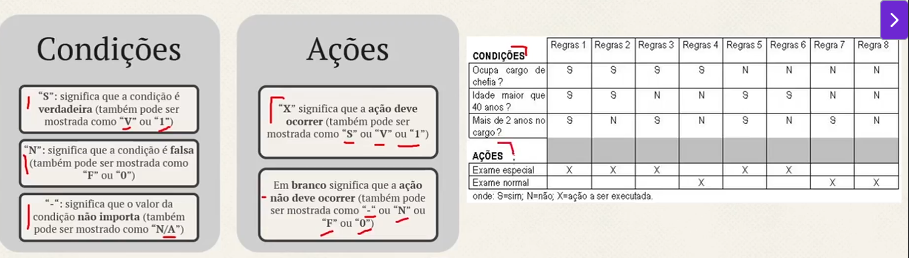
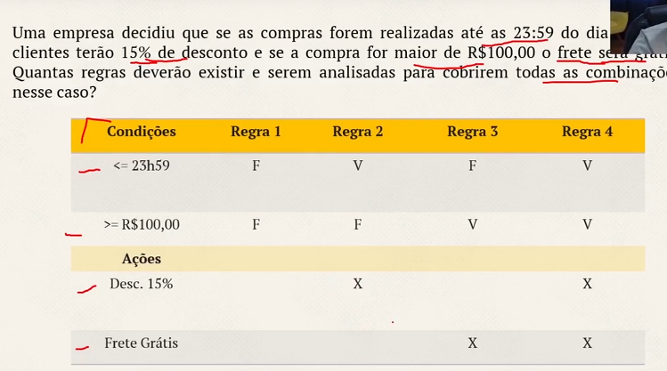

---


#### Teste de transição de estado

- Mostra os possiveis estados do software
- A mudança de estado pode fazer com que o software execute uma ação
- Uma **tabela de transição de estado** mostra transições **validas** e potencialmente **invalidas** entre estados
- Um **driagrama de transição de estado** mostra **apenas as transições validas**

---

#### Teste de transição de estado
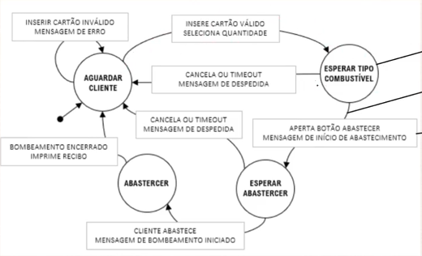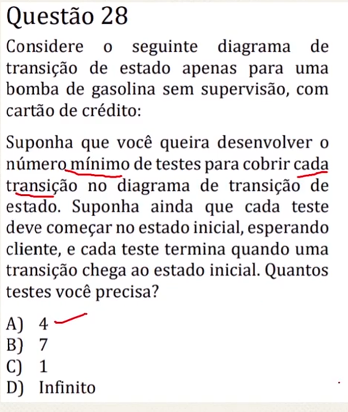

---


## Tecnicas de teste CAIXA BRANCA

- Baseado na **estrutura interna** do objeto de teste (classe, funções, modulos)
- Geralmente feito pelo **desenvolvedor**

---

#### Teste e cobertura de instruções / Declaração / Comando / Sentença

- Instruções são linhas de codigo que não necessitam de condições para serem executadas.

- Tem o objetivo de testar as **Instruções executaveis do codigo**

- PERCENTUAL DE COBERTURA: (INSTRUÇÕES EXECUTADAS / INSTRUÇÕES EXISTENTES) * 100

- É a tecnica de caixa branca **menos eficiente**

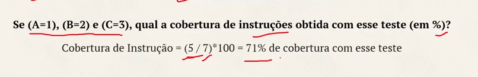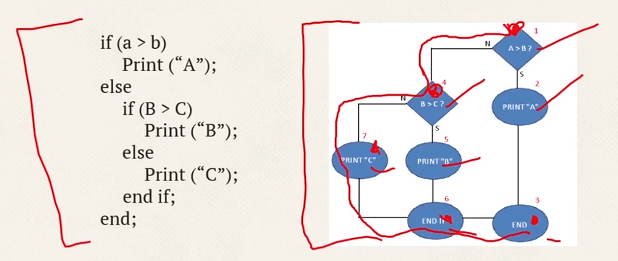

---

#### Teste e cobertura de Decisão / Desvio / Ramificação

- Testa **decisões existentes no codigo** e o codigo executado com base nos resultados da decisão

- Casos de Teste criados para **cobrir as decisões existentes** (em uma instrução IF, um para o resultado verdadeiro e outro para o resultado falso; em um CASE, para todos os possiveis resultados, incluindo o padrão)

- **PERCENTUAL DE COBERTURA DE DECISÃO**: (NUMERO DE RESULTADOS DE DECISÃO EXECUTADOS / TOTAL DE DECISÕES EXISTENTES) * 100

- 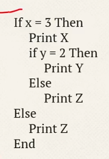

- Fluxograma:
  - 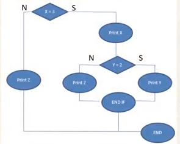

  
  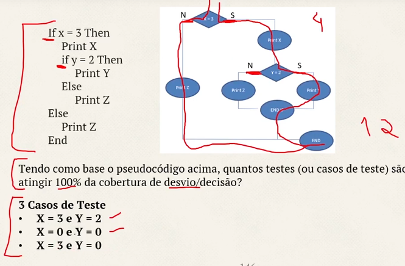

---

## Tecnicas baseadas na experiencia

- Derivados da **habilidade e intuição do testador**

--- 
#### Suposição de erro

- **Prever a ocorrencia de erros, defeitos e falhas** com base no **conhecimento do testador**

- Como o aplicativo funcionou no passado;
- Que tipo de erro tendem a ser cometidos;
- falhas ocorridas em outros apps; 

--- 

#### Teste exploratorio

- Os resultados do teste são usados para **aprender mais sobre o componente ou sistema** e para **criar testes para as areas que podem precisar** de mais testes.

- As vezes é realizado usando **testes baseados em sessão**

- No Teste abseado em sessão, o teste exploratorio é conduzido **dentro de uma janela de tempo definida**

- É mais util quando há **poucas ou inadequadas especificações ou pressão de tempo** significativa nos testes


#### Teste baseado em checklist

- Executam testes para cobrir condições de teste encontradas em uma lista.
  - Testadores podem **criar, expandir ou usar uma lista** existente sem modifica-la

- Checklists **podem ser construidos com base na experiencia**

--- 
```plaintext
Análise e Modelagem
├── Baseadas em especificação (caixa-preta)
│   ├── Particionamento de equivalência
│   ├── Análise de valor limite
│   ├── Tabela de decisão
│   ├── Transição de estados
│   └── Casos de uso
├── Baseadas na estrutura (caixa-branca)
│   ├── Cobertura de instrução
│   ├── Cobertura de decisão
│   └── Cobertura de caminho
└── Baseadas em experiência
    ├── Teste exploratório
    └── Checklist
```

## Abordagens de teste baseadas na colaboração

#### Escrita colaborativa de historias de usuarios
- Conjunto 3c
  - **Cartão**: o meio onde se descreve uma historia de usuario
  - **Conversação**: Explicação de como o software sera usado (documentado ou verbal)
  - **Confirmação**: Os criterios de aceite
  
- **Como**[ator ou persona], **quero** [meta a ser cumprida], **para que eu possa**[valor de negocio resultante para a função]

- **Visão compartilhada do que deve ser entregue**, levando em conta três perspectivas: **negocios, desenvolvimento e testes**

- **Boas historias de usuarios devem ser:**
  - independentes
  - negociaveis
  - valiosas
  - estimaveis
  - pequenas
  - testaveis

#### Criterios de aceite
- Condições que a implementação deve atender para ser aceita
- Podem ser vistos como as condições de teste que devem ser executadas pelos testes
- Criterios de aceite **geralmente são resultados da conversação**
- 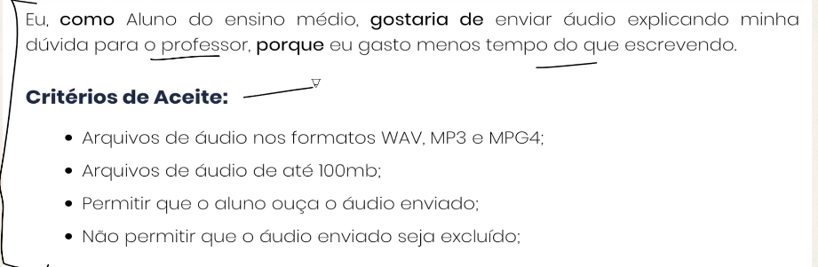

- São usados para: 
  - Definir o escopo da historia de usuario
  - Chegar a um consenso entre os stakeholders
  - Descrever os cenarios positivos e negativos
  - Servir como base para o teste de aceite da historia de usuario
  - Permitir planejamento e estimativa precisos 

- Formatos comuns:
  - Orientados a cenarios : BDD
  - Orientado por regras: Lista de pontos de verificação ou forma tabulada de mapeamento de entrada e saida


#### Desenvolvimento Orientado por Teste de Aceite (ATDD)
- Prioriza o teste
- CT criados antes da implementação da historia de usuario
- 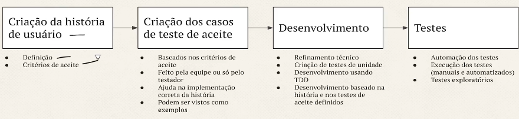


- Sobre casos de teste no ATDD:
  - Testes positivos primeiro, depois testes negativos
  - cobrir caracteristicas **não funcionais**