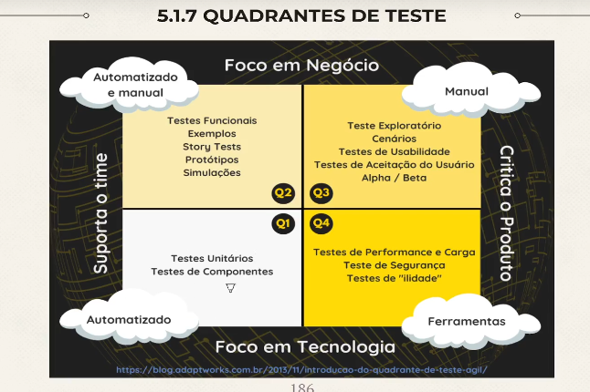

# Gerenciamento das atividades de teste

## Objetivo e conteudo de um plano de teste

- Descreve os objetivos, os recursos e os processos de um projeto
  - **Documenta os meios e o cronograma** para atingir os objetivos do teste
  - **Garantir que as atividades de teste realizadas atenderão aos criterios** estabelecidos
  - Meio de comunicação com os membros da equipe e outros stakeholders
  - **Testes seguirão a politica e estrategia existentes**
- Plano de testes inclui:
  - Contexto do teste (Escopo, objetivos do teste, restrições, base do teste)
  - Premissas e restrições do projeto de teste
  - Stakeholders
  - Comunicação (formas e frequencia, modelos de documentação)
  - Registros de riscos
  - Abordagem de teste
  - Orçamento e cronograma

### Contribuição do testador para o planejamento de iteração e liberação

- Planejamento de liberação prevê o lançamento de uma nova versão

  - Participam da escrita das historias de usuario
  - Participam da escrita de criterios de aceites testaveis
  - Participam das analises de risco do projeto e da qualidade
  - Estimam o esforço de teste associado as historias de usuario
  - Determinam a abordagem de teste
  - Planejam o teste para a versão

- Planejamento de iteração prevê o fim de uma iteração (sprint)
  - Participam da analise de risco detalhada as historias de usuarios
  - Determinam a testabilidade das historias
  - Dividem as atividades de teste em tarefas
  - Estimam o esforço de teste para todas as tarefas de teste
  - Identificam e refinam aspectos funcionais e nao funcionais

### Criterios de entrada e saída

- **Criterios de Entrada (DoR - Definição de Pronto)**

  - Tudo que deve estar OK para os testes possam iniciar

  - **Criterios tipicos de entrada:**

    - **Disponibilidade de recursos**(pessoas, ferramentas, ambientes)
    - **Disponibilidade de material de test**(Historias de usuario, casos de teste)
    - **Nivel de qualidade inicial de um objeto de teste** (ex: todos os smoke testes foram aprovados)

- **Criterios de Saída**(DoD - Definição de Pronto)

  - O que devem ser atingido para declarar que um nivel de teste foi concluido

  - Criterios tipicos de saída:
    - Medidas de precisão (nivel de cobertura alcançado)
    - Criterios de conclusão (testes planejados foram executados, todos os defeitos encontrados foram relatados, todos os testes de regressão foram automatizados)
    - Esgotamento do tempo ou orçamento

### Tecnicas de estimativa

#### Tenica baseada em indices

- O esforço do teste é estimado com base nas **metricas de projetos anteriores**

#### Extrapolação

- Baseada em metricas, coleta-se dados de medições o mais cedo possivel e com eles pode-se estimar o trabalho restante por meio da extrapolação desses dados

- Exemplo: A equipe pode extrapolar o esforço de teste na proxima iteração como esforço medio das tres ultimas iterações

#### Wideban Delphi

- Especialistas estimam com base na experiencia
- Cada estimativa estima isoladamente
- Resultados comparados e discutem as divergencias ate chegar em um consenso

- Exemplo: Planning Poker

#### Estimativa de tres pontos

- Baseada em especialistas
- 3 estimativas são feitas (otimistas, mais provavel e pessimista)
- Estimativa final é a media aritmetica ponderada dessas estimativas

### Priorização de casos de teste

#### Estrategias de priorização

- **Baseada em risco**

  - A ordem de execução é baseada nos resultados da analise de risco. Os casos que abrangem os riscos mais importantes são executados primeiro

- **Baseada em cobertura**

  - Casos de teste que atingem a maior cobertura são executados primeiro

- **Baseada em requisitos**
  - A ordem é baseada nas prioridades dos requisitos. Testes relacionados aos requisitos mais importantes são executados primeiro

### Piramide de teste

- Quanto mais pra baixo, mais rapido e barato de executar
- Quanto mais pra cima, mais lento e caro

- Base: Testes de Unidade
  - Meio: Testes de Integração
    - Topo: Testes Ponta a Ponta (E2E, UI ou Testes de Interface)

### Quadrantes de teste

- Agrupam niveis de teste com os tipos de teste

- Garantir que todos os tipos e niveis de teste apropriados sejam incluidos no sdlc

### Gerenciamento de risco

- Analise de risco
- Controle de riscos (monitorar e mitigar os riscos)

#### Definição e atributos de risco

- Risco é um possivel **evento, perigo, ameaça ou situação**

- Nivel de risco é determinado pela **probabilidade** e pelo **impacto**

- **NIVEL DE RISCO = PROBABILIDADE X IMPACTO**

#### Riscos do projeto e riscos do produto

- Risco de produto

  - Esta relacionado ao que voce esta testando (funcionalidade, componente)
  - caracteristicas especificas de qualidade de um produto

  - Insatisfação do usuario
  - Perda de receita, confiança e reputação
  - Danos a terceiros
  - Altos custos de manutenção
  - Penalidades criminais
  - Danos fisicos, lesões ou ate mesmo morte

- Riscos de projeto

  - Relacionado ao gerenciamento do projeto
  - Situações que caso ocorram, podem ter um efeito negativo na capacidade de um projeto atingir seus objetivos

  - Atrasos na entrega, Estimativas imprecisas...
  - Questões organizacionais
  - Questões politicas
  - Questões tecnicas
  - questões de fornecedores

#### Analise de risco do produto

- Avaliação dos riscos

- Proporcionar conscientização do risco do produto para concentrar o esforço de teste

- Analise comece no inicio do SDLC

#### Controle de risco do produto

- mitigação e monitoramento dos riscos
- implementação das ações propostas na avaliação de riscos

- Garantir que as ações de mitigação sejam eficazes
- melhorar a avaliação de riscos
- Identificar riscos emergentes

- mitigação por meio de testes, aceite do risco, transferencia do risco ou plano de contingencia.

- ações por meio de testes:
  - testadores com nivel de experiencia e habilidade adequado;
  - Aplicar um nivel adequado de independencia de testes;
  - Conduzir revisões e realizar análises estaticas
  - Tecnicas e niveis de cobertura adequados;
  - tipos de teste apropriados
  - Realizar testes dinamicos, incluindo testes de regressão

### Monitoramento, controle e conclusão do teste

- no monitoramento: Avaliar o progresso do teste e medir se os criterios de saida do teste foram atendidos
- Controle de teste: Usa informação do monitoramento para fornecer orientação e ações corretivas necessarias

  - Repriorizar testes
  - Reavaliar se um item atende aos criterios de entrada ou saída
  - Ajustar cronograma

- Conclusão: Coleta dados de atividades de teste concluidas
  - Ocorrem em marcos do projeto: software lançado, versão de manutenção concluida, final de alguma coisa

#### Metricas usadas em testes

- Podem ser coletadas durante o fim das atividades do teste

  - Relação entre o planejado e o orçado
  - Qualidade do atual objeto de teste
  - Rendimento das atividades de teste em relação aos objetivos

- Metricas:
  - progresso do projeto
  - Progresso do teste
  - Qualidade do produto
  - Metricas de defeitos
  - metricas de risco
  - Metricas de cobertura
  - metricas de custo

#### Relatorios de teste: objetivo, conteudo e alvo

- Resumem e comunicam as informações do teste

- Relatorios de progresso dão suporte ao controle continuo do teste

- relatorios de conclusão resumem um estagio especifico do teste

- **Conteudo:**

  - Relatorio de progresso são gerados regularmente (semanalmente etc)

    - Periodo de teste
    - Progresso do teste
    - Impedimentos
    - Metricas
    - Riscos
    - Testes planejados

  - Relatorio de conclusão é preparado durante a conclusão do teste
    - Resumo do teste
    - Testes e avaliação da qualidade
    - Desvios do plano de teste
    - Impedimentos e soluções
    - metricas baseadas em relatorios de progresso
    - Riscos não mitigados

- Publico alvo
  - Publicos diferentes = informações diferentes
  - progresso = informais
  - Conclusão = modelo definido   

#### Comunicação do status dos testes
- Varia de acordo com a necessidade

- Comunicação verbal
- Paineis (CI/CD)
- Canais de comunicação eletronica
- Documentação on-line
- Relatorios de testes formais

### Gerenciamento de Configuração

- Objetivo estabelecer e manter a integridade do componente ou do sistema
- Identificar, controlar e rastrear produtos de trabalho
- Mantem um registro dos itens de configuração alterados
- É possivel reverter para uma baseline anterior para reproduzir resultados de testes anteriores

### Gerenciamento de defeitos

- Anomalias podem ser relatadas durante qualquer fase do SDLC
- Inclui um fluxo de trabalho para lidar com anomalias
- Alguns dados podem ser incluidos automaticamente ao usar ferramentas de gerenciamento de defeitos

- objetivos: 
  - Informações para resolver o problema
  - Fornecer meios de rastrear a qualidade do produto de trabalho e o impacto no teste
  - Fornecer ideias para aprimoramento dos processos de teste

- Conteudo de um relatorio de defeitos
  